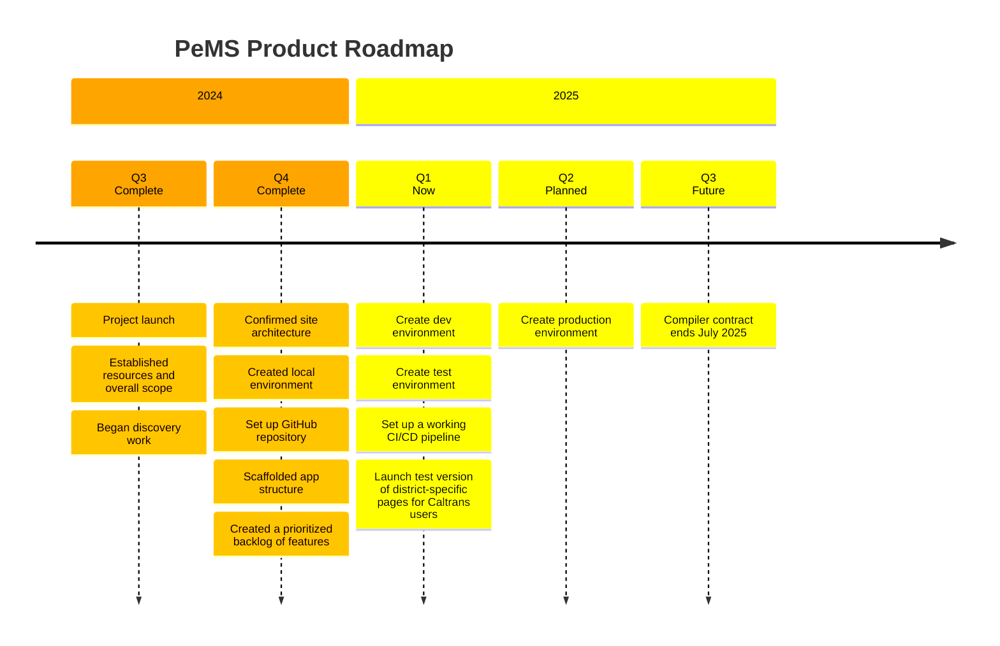

# PeMS

Caltrans Performance Measurement System

PeMS is open-source software that is designed, developed, and maintained by [Compiler LLC](https://compiler.la) on behalf of Caltrans Traffic Operations.

## Current Work

We do sprint planning and track day-to-day work in our [Project Board](https://github.com/orgs/compilerla/projects/3/views/1).

See our current [Milestones](https://github.com/compilerla/pems/milestones) for a higher level view of project progress.

## Product Roadmap

Our product roadmap captures what we're currently building, what we've built, and what we plan to build in future quarters. It is updated on a regular basis, aligned with project progress.

